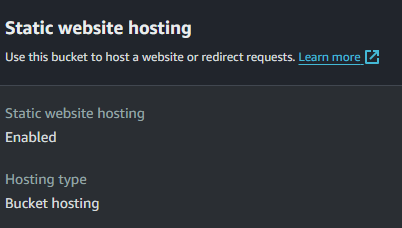
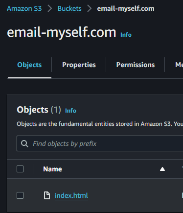
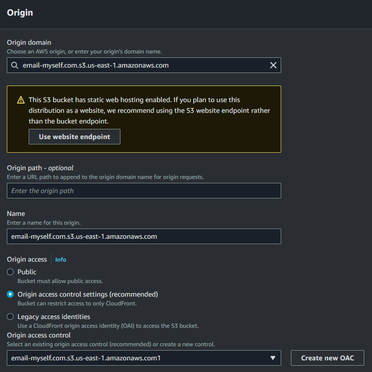
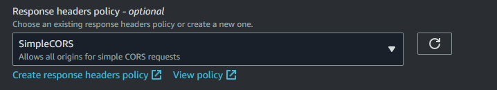
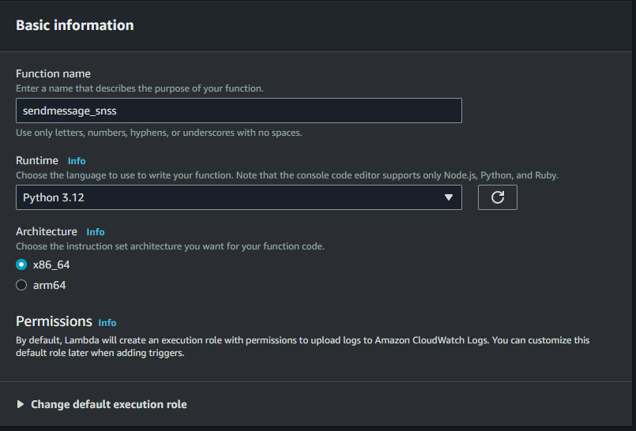
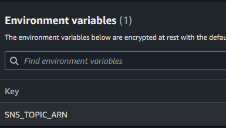

# EmailMyself

This repository contains files used for a simple AWS website setup for email-myself.com utilizing Route 53, Amazon Cloudfront, S3, API Gateway, Lambda, and SNS Topics. 

Below is a diagram of how it's setup:

# S3 bucket setup

1. Create a bucket that matches the name of your website (example.com)
2. In the properties section of your bucket go to "Static website hosting" and chanhe to "Enabled"
3. Upload your website files, in my example I just have "index.html" uploaded in the root:

# Route 53 Setup
1. Purchase a domain via Route 53, this will automatically create a hosted zone. 

# CloudFront Setup
1. Create a distribution
2. For origin select "Amazon S3" then your S3 website endpoint
3. For origin access select "Origin access control settings" (recommended) then "Create new OAC"

4. Change "Response headers policy" to "SimpleCORS" to allow all origins for simple CORS requests

5. After the distribution is saved a pop-up will come up that will ask you to copy the policy to allow Cloudfront access to your S3 bucket. Copy the policy then add it to your S3 bucket policy. 

# SNS Topic Setup
1. Create new topic and choose type "Standard", give it a name and leave the defaults
2. Once created select "Create subscription" then protocol "Email", and put in your email address. 
3. Make sure to click the link in your email to confirm the subscription. 
4. Copy the ARN of the topic for the next step.

# Lambda Setup
1. Create new function, give it a name and select runtime as "Python 3.12"

2. Either zip up the sendmessage_sns_lambda.py file and upload it to the lambda console or paste the contents into the code source page and save
3. Go to "Configuration" then "Enviroment variables" then add a new enviroment variable with the key "SNS_TOPIC_ARN" and in the value field put in the ARN of your SNS topic.

# API Gateway Setup
1. Create API, choose API type as "HTTP API" then "Build"
2. Add Integration "Lambda" and choose the lambda function you created earlier, then give the API a name
3. For "configure routes" select method as "POST" then resource path as "/sendmessage_sns" and finish creation
4. Back on the main API Gateway page select "Custom domain name" and put create a custom domain name for your api such as "api.example.com"
5. Create a new ACM certificate for your custom domain and select it
6. Go back to Route53 and create an A record that matches your custom domain then select "Alias" -> "Alias to API Gateway API" -> Select your region -> Then select your API Gateway and create the record.
7. Go back to Cloudfront distribution, create origin, choose your API gateway
8. Then go to "Behaviors" "Create behavior", put path pattern as "/sendmessage_sns", and select "Response headers policy" as "Simple CORS"
9. Go back to API Gateway then "CORS" and set "Access-Control-Allow-Origin" as your domain name, Access-Control-Allow-Methods as POST and OPTIONS, and Access-Control-Allow-Headers as *

